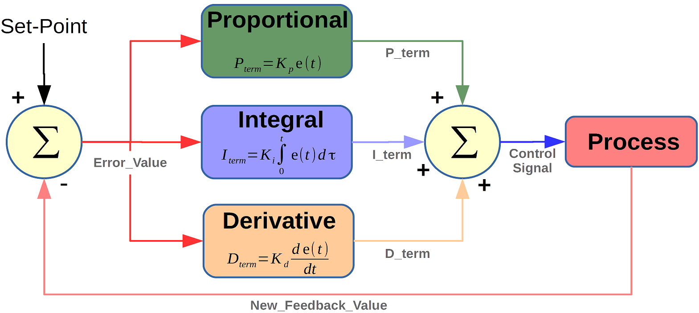
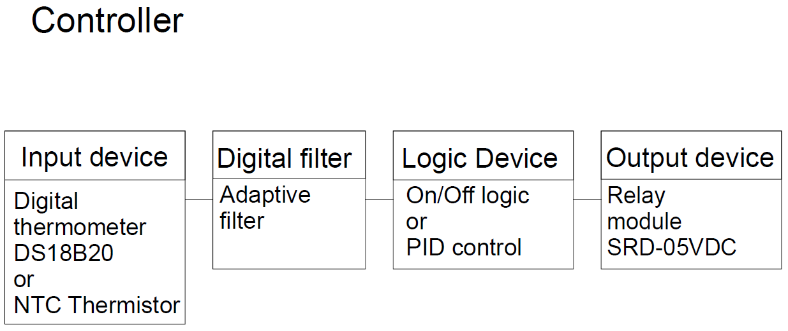

# STM32_Heat_controller

## Oversimplified version of TRM1 (heat controller) based on STM32F103C8. 

## Additional devices

- DS18B20 input (temperature)
- SRD-05VDC relay output

## Features

- ON-OFF regulator

- PID regulator

- Adaptive filter

## Project goal

Design relatively cheap heat cotroller

## Tech

- [Adaptive filter implementation](https://alexgyver.ru/lessons/pid/)

- [DS18B20](https://github.com/vtx22/STM32-DS18B20)

- [PID controller implementation](https://alexgyver.ru/lessons/pid/)

- [TM1637](https://github.com/UsefulElectronics/stm32-tm1637-library)

## Requirements

STM32CubeIDE 1.11.0 or higher

## Schemes

## Documentation

[by Doxygen](Docs)
